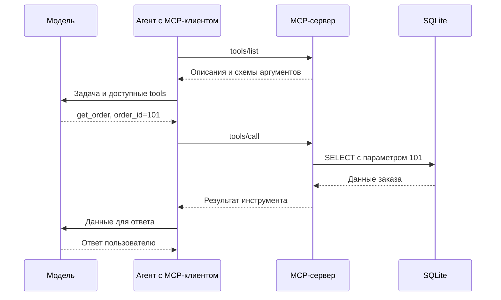

# MCP: подключаем к агенту Python-функции, SQL и HTTP API

Материал для студентов 3–4-го курса ИТ-направлений. Требуются Python, основы SQL и понимание вызова инструментов в ReAct-агенте.

Код рассчитан на **официальный Python SDK `mcp==2.3.0`**. Используется `MCPServer` из `mcp.server`. Старые примеры с `FastMCP` из SDK v1 и отдельный пакет `fastmcp` не следует смешивать с этим комплектом. Версии зависимостей зафиксированы в `starter/requirements.txt`. [1]

## 1. Что такое MCP и зачем он нужен

**MCP — Model Context Protocol: протокол, по которому приложение агента получает список доступных инструментов, вызывает их и получает результат.** Сервер также может предоставлять ресурсы и шаблоны запросов. [2]

Допустим, у нас есть Python-функция `get_order(order_id)`. Сама по себе модель вызвать её не может. Приложение должно сообщить модели о функции, получить выбранное действие и выполнить код.

Без MCP можно вручную встроить функцию в конкретного агента. С MCP мы выносим её в сервер с типовым интерфейсом. Совместимый клиент умеет запросить описание инструмента и вызвать его, не зная заранее устройство нашей базы или HTTP API.

Практическая польза — переиспользование интеграции: один сервер можно подключать к разным приложениям с поддержкой подходящей версии MCP и транспорта. Для одной функции внутри своего агента MCP не обязателен: обычный tool часто проще.

**MCP-сервер — обычная программа.** В нашем случае это Python-процесс. Ему не нужны собственная LLM, GPU или API-ключ модели. MCP-клиент тоже можно написать без LLM — и использовать для проверки сервера.

## 2. Кто что делает

| Участник | Работа |
|---|---|
| Модель | Выбирает инструмент и формирует аргументы, если приложение использует её для этого |
| Приложение агента, MCP host | Ведёт диалог, связывает модель с инструментами, управляет разрешениями |
| MCP client | Общается с конкретным MCP-сервером |
| MCP server | Публикует инструменты и исполняет их обработчики |
| База или API | Хранит данные и выполняет предметные операции |

Пример: «Покажи заказ 101».



MCP не заменяет `chat/completions`: это разные соединения. Приложение преобразует полученные от MCP описания в формат tools выбранного модельного API и возвращает результаты вызовов в историю. Конкретное представление зависит от приложения.

## 3. Что сервер предоставляет

| Возможность | Пример | Как используется |
|---|---|---|
| Tool | `get_order(order_id)` | Выполнить операцию с аргументами |
| Resource | `shop://schema` | Прочитать данные по URI, например описание таблиц |
| Prompt | Шаблон разбора заказа | Получить подготовленный шаблон сообщений |

В практикуме сосредоточимся на tools. Resources и prompts не обязательны для каждого сервера. Их поддержка и отображение зависят от клиента. [2]

**Skill и MCP:** skill содержит инструкцию, как выполнять работу; MCP предоставляет интерфейс к операциям и данным. Например, skill проверки заказа может указывать использовать `get_order`, затем `get_delivery`. Исполнять эти инструменты будет MCP-сервер.

## 4. Что передаётся по протоколу

MCP использует JSON-RPC 2.0. У запроса есть имя метода, аргументы и идентификатор, связывающий запрос с ответом. [2]

Ниже только существенные поля вызова, **не полный пакет для ручной отправки**: служебные метаданные и совместимость версий обеспечивает SDK.

```json
{
  "jsonrpc": "2.0",
  "id": 7,
  "method": "tools/call",
  "params": {
    "name": "get_order",
    "arguments": {"order_id": 101}
  }
}
```

Два уровня названий:

- `tools/call` — метод самого протокола;
- `get_order` — инструмент, который написал разработчик сервера.

`tools/list` возвращает имена инструментов, описания и схемы входных данных. Поэтому аргументы и docstring — часть интерфейса: по ним приложение и модель понимают, что можно вызвать.

У результата вызова есть блоки содержимого `content`, необязательные структурированные данные и признак ошибки. В Python SDK v2 соответствующие атрибуты называются `structured_content` и `is_error`; в JSON протокола используются `structuredContent` и `isError`. [3, 4]

## 5. Как соединяются клиент и сервер

| Транспорт | Как работает | Для этого занятия |
|---|---|---|
| `stdio` | Клиент запускает сервер как дочерний процесс и обменивается сообщениями через stdin/stdout | Основной вариант: не нужен порт |
| Streamable HTTP | Сервер слушает HTTP-адрес, клиент подключается к MCP endpoint | Дополнительный вариант |

Название «сервер» не означает, что процесс обязательно слушает сетевой порт. При `stdio` достаточно Python-файла, который запускает клиент. Отладочные сообщения сервера направляйте в stderr через `logging`, не в stdout протокола. [5]

В упражнении с FastAPI соединения будут разными: **клиент ↔ MCP по stdio**, **MCP ↔ FastAPI по HTTP**. У FastAPI будет порт 8000, у MCP-процесса — нет.

## 6. Первый сервер и вызов без модели

Распакуйте архив и перейдите в папку `starter`. Команды ниже — для Linux/macOS:

```bash
python3 -m venv .venv
source .venv/bin/activate
python -m pip install -r requirements.txt
```

Проверено на Python 3.12. В Windows окружение активируется командой `.venv\Scripts\Activate.ps1` в PowerShell; примеры с JSON в командной строке при необходимости перенесите в Python-клиент, чтобы избежать различий кавычек оболочки.

Файл `example_basic.py`:

```python
from typing import Any
from mcp.server import MCPServer
from mcp.server.mcpserver.exceptions import ToolError

mcp = MCPServer("price-demo")


@mcp.tool()
def calculate_total(price_kopecks: int, quantity: int) -> dict[str, Any]:
    """Рассчитать стоимость покупки в копейках без скидок и доставки."""
    if price_kopecks < 0 or quantity < 1:
        raise ToolError("Цена должна быть неотрицательной, количество — не меньше 1")
    return {"total_kopecks": price_kopecks * quantity, "currency": "RUB"}


if __name__ == "__main__":
    mcp.run(transport="stdio")
```

Здесь:

- `@mcp.tool()` регистрирует Python-функцию как инструмент;
- имя функции становится именем инструмента;
- docstring описывает назначение;
- аннотации аргументов используются для построения схемы;
- функция проверяет предметные ограничения и возвращает результат;
- `mcp.run()` запускает обработку протокола. [1, 6]

Проверка через готовый клиент:

```bash
python client.py example_basic.py
python client.py example_basic.py calculate_total '{"price_kopecks":15000,"quantity":3}'
```

Первый вызов показывает tools и их схемы. Второй возвращает `total_kopecks=45000`, `currency="RUB"`, `is_error=false`.

Клиент сам запускает и завершает MCP-процесс. Отдельно запускать `example_basic.py` в другом терминале не надо.

Короткий вариант того же клиента:

```python
import asyncio
import sys
from pathlib import Path
from mcp import Client, StdioServerParameters

async def main():
    server = StdioServerParameters(
        command=sys.executable,
        args=[str(Path("example_basic.py").resolve())],
    )
    async with Client(server) as client:
        catalog = await client.list_tools()
        print([tool.name for tool in catalog.tools])
        result = await client.call_tool(
            "calculate_total", {"price_kopecks": 15000, "quantity": 3}
        )
        print(result.is_error)
        print(result.structured_content)

asyncio.run(main())
```

Код запускается из `starter`. Здесь вызов выбирает программист. В агенте имя инструмента и аргументы обычно предлагает модель, а выполняет тот же MCP-клиент. [3]

## 7. Оборачиваем SQLite

В архиве уже есть `shop.db`. При необходимости её можно восстановить:

```bash
python init_db.py --reset
```

Команда сбрасывает **учебную** базу рядом со скриптом. Не подставляйте в генератор путь к своей рабочей БД.

Файл `example_sqlite.py`:

```python
from typing import Any
import os
import sqlite3
from contextlib import closing
from pathlib import Path

from mcp.server import MCPServer
from mcp.server.mcpserver.exceptions import ToolError

mcp = MCPServer("sqlite-example")
DB = Path(os.getenv("SHOP_DB", Path(__file__).with_name("shop.db"))).resolve()


@mcp.tool()
def get_customer(customer_id: int) -> dict[str, Any]:
    """Получить имя и город клиента магазина по его ID."""
    if not DB.is_file():
        raise ToolError("Файл БД не найден: проверьте настройку SHOP_DB")
    with closing(sqlite3.connect(DB.as_uri() + "?mode=ro", uri=True)) as conn:
        conn.row_factory = sqlite3.Row
        row = conn.execute(
            "SELECT id, name, city FROM customers WHERE id = ?",
            (customer_id,),
        ).fetchone()
    if row is None:
        raise ToolError("Клиент не найден")
    return dict(row)


if __name__ == "__main__":
    mcp.run(transport="stdio")
```

```bash
python client.py example_sqlite.py get_customer '{"customer_id":1}'
```

Результат: `{"id":1,"name":"Анна","city":"Кострома"}`.

Что добавилось к обычной работе с SQLite:

1. Декоратор публикует функцию через MCP.
2. Параметр инструмента передаётся в SQL через `?`, не через f-строку.
3. Строка БД преобразуется в словарь.
4. Отсутствующий клиент превращается в понятную ошибку инструмента.

`mode=ro` открывает БД только для чтения. `closing` закрывает соединение после вызова. Путь вычисляется относительно файла сервера, поэтому не зависит от текущей папки клиента. Настройкой `SHOP_DB` можно передать другой путь. [7]

**Не обязательно давать агенту произвольный SQL.** Инструменты `get_order` или `sales_summary` проще описать и проверить. Общий `run_sql(query)` — другая задача: нужны контроль прав, ограничение стоимости запросов и объёма ответа. Проверка `query.startswith("SELECT")` не является полноценным ограничением доступа.

## 8. Оборачиваем HTTP API

**В MCP можно обернуть практически любое программно доступное API:** HTTP, SDK библиотеки, SQL-драйвер, RPC. Обработчик tool вызывает исходную операцию и приводит результат к удобному формату.

Это не автоматический доступ ко всему. Обёртка должна иметь сеть, авторизацию и необходимые права. Потоковую операцию, загрузку большого файла или длительную задачу иногда нужно представить несколькими инструментами.

Для обычного HTTP API соответствие выглядит так:

| MCP tool | Действие внутри обработчика |
|---|---|
| `get_delivery(order_id)` | `GET /shipments/{order_id}` |
| `list_deliveries(status)` | `GET /shipments?status=...` |
| `quote_delivery(weight_grams, zone)` | `POST /shipping/quote` с JSON |
| `reschedule_delivery(order_id, planned_date)` | `POST /shipments/{order_id}/reschedule` |

FastAPI сам по себе не становится MCP-сервером. Документ OpenAPI `/openapi.json` описывает его HTTP-операции; это не endpoint MCP. Можно генерировать адаптеры из OpenAPI, но корректность описаний, авторизации и обработки ошибок всё равно нужно проверять.

Запустите готовый мок-API в отдельном терминале из `starter`:

```bash
python -m uvicorn mock_api:app --host 127.0.0.1 --port 8000
```

Документация API: `http://127.0.0.1:8000/docs`. Там можно вызвать операции напрямую. [8]

Файл `example_http.py` оборачивает только проверку доступности API — остальные операции студенты реализуют в практикуме:

```python
from typing import Any
import os

import httpx
from mcp.server import MCPServer
from mcp.server.mcpserver.exceptions import ToolError

mcp = MCPServer("delivery-health-example")
API_URL = os.getenv("DELIVERY_API_URL", "http://127.0.0.1:8000").rstrip("/")


@mcp.tool()
async def delivery_health() -> dict[str, Any]:
    """Проверить доступность API доставки. Не проверяет состояние конкретного заказа."""
    try:
        async with httpx.AsyncClient(timeout=5.0) as client:
            response = await client.get(f"{API_URL}/health")
            response.raise_for_status()
            return response.json()
    except httpx.HTTPStatusError as exc:
        raise ToolError(f"API вернул HTTP {exc.response.status_code}") from exc
    except httpx.RequestError as exc:
        raise ToolError("API доставки недоступен или не ответил вовремя") from exc
    except ValueError as exc:
        raise ToolError("API вернул ответ не в формате JSON") from exc


if __name__ == "__main__":
    mcp.run(transport="stdio")
```

Во втором терминале с активированным окружением:

```bash
python client.py example_http.py delivery_health
```

Результат: `{"status":"ok","service":"delivery-demo"}`.

Это настоящая HTTP-обёртка: она не импортирует данные или функции из `mock_api.py`. Адрес задаётся настройкой `DELIVERY_API_URL`, по умолчанию используется localhost. Таймаут не позволяет ждать ответа бесконечно. `raise_for_status()` отделяет HTTP-ошибку от успешного ответа. [9]

## 9. Ошибки — тоже часть интерфейса

Различайте три ситуации:

| Ситуация | Что вернуть или сообщить |
|---|---|
| Поиск выполнен, совпадений нет | Успешный результат с пустым списком |
| Заказ с конкретным ID отсутствует, API вернул 404 | Ошибка инструмента с объяснением |
| Процесс MCP не запустился или связь оборвалась | Ошибка подключения на стороне клиента |

Для ожидаемого сбоя обработчика в этих примерах используется `ToolError`. Клиент получает `is_error=true` и сообщение в `content`. Не возвращайте `[]` вместо «API недоступен»: это разные факты. [6]

Описание «только чтение» не ограничивает права кода. Ограничение должно существовать в реализации: например, read-only соединение с SQLite. Операцию изменения даты доставки вызывают только по соответствующему запросу пользователя; сам MCP не доказывает наличие такого запроса.

## 10. Подключение к агенту и HTTP-вариант

Для локального MCP-сервера приложению нужны путь к Python из окружения, путь к серверу и его настройки. Например:

```text
command: /absolute/path/starter/.venv/bin/python
args: [ /absolute/path/starter/student_sqlite.py ]
env:
  SHOP_DB: /absolute/path/starter/shop.db
```

Это перечень параметров, а не универсальный конфигурационный файл. Внесите их в формат, который поддерживает выбранное приложение. После подключения проверьте список tools и один вызов.

Для опыта с HTTP скопируйте `example_basic.py` в `example_basic_http.py` и замените последнюю строку запуска:

```python
mcp.run(transport="streamable-http", host="127.0.0.1", port=8001)
```

Теперь сервер надо запустить отдельно, а клиенту передать URL:

```bash
python example_basic_http.py
# Во втором терминале:
python client.py http://127.0.0.1:8001/mcp calculate_total '{"price_kopecks":15000,"quantity":3}'
```

Инструмент тот же; изменился транспорт. Порт 8001 выбран, чтобы не конфликтовать с мок-API на 8000. [5]

## Источники

Проверено 9 октября 2026 года. Примеры и данные разработаны для занятия. Устанавливайте версии из комплекта: интерфейсы SDK разных поколений отличаются.

1. [Официальный Python SDK, v2](https://py.sdk.modelcontextprotocol.io/).
2. [Архитектура MCP](https://modelcontextprotocol.io/docs/learn/architecture).
3. [Python MCP client](https://py.sdk.modelcontextprotocol.io/client/).
4. [Структурированный результат](https://py.sdk.modelcontextprotocol.io/servers/structured-output/).
5. [Запуск сервера и транспорты](https://py.sdk.modelcontextprotocol.io/run/).
6. [Обработка ошибок](https://py.sdk.modelcontextprotocol.io/servers/handling-errors/).
7. [Python sqlite3](https://docs.python.org/3/library/sqlite3.html).
8. [FastAPI: первое приложение](https://fastapi.tiangolo.com/tutorial/first-steps/).
9. [HTTPX: запросы и ответы](https://www.python-httpx.org/quickstart/).
